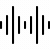

  

  <h3 align="center">Wavesonic 🌊</h3>

  

      Elevate Your Sound Experience: Visualize, Feel, Connect!
     
    <a href="https://wavesonic.netlify.app/"><strong>Go to App »</strong></a>
     
     
    <a href="https://github.com/prerana1821/wavesonic/pulls">Raise a PR</a>
    ·
    <a href="https://github.com/prerana1821/wavesonic/issues">Report Bug</a>
    ·
    <a href="https://github.com/prerana1821/wavesonic/issues">Request Feature</a>
  

Introducing our innovative audio visualization app, where you can bring your music to life like never before. With just a few clicks, upload your favorite audio files and watch as vibrant sound bars dance across the screen, reflecting the rhythm and intensity of the music. Dive into the world of audio visualization and experience your music in a whole new light. Whether you're a music enthusiast, a casual listener, or a creative mind seeking inspiration, our app offers an engaging and immersive way to interact with your audio content. Let the sound speak to you, and embark on a captivating journey of sight and sound with our audio visualization app.

## Demo

[need to add a link]

## Key Features

- Audio Upload Functionality: Supports various audio formats.
- Audio Visualization: Visualizes audio data in real-time using a canvas element.
- Dynamic Sound Bars: Provides a visual representation of audio frequency and intensity.
- Audio Processing: Utilizes the Web Audio API for audio processing.
- Real-time Visualization: Creates an Audio Context, Audio Source, Analyser, and Audio Destination for sound manipulation and visualization in real-time as the audio plays..

## Technologies Used

- HTML5/CSS
  - Canvas API: Renders dynamic sound bars for audio visualization.
- JavaScript:
  - Web Audio API: Analyzes and processes audio data for visualization.

## Blogs to be written based on my learnings

- [ ] How to use the Web Audio API for audio processing?

## Installation

No installation is required. Simply open the project in a web browser to start drawing!

## Contributing

I welcome contributions from the community to improve Skillful CV. If you find a bug or have an idea for a new feature, feel free to create an issue or submit a pull request.

## License

This project is licensed under the MIT License. See the LICENSE file for more details.

## Acknowledgments

I extend my gratitude to the developers of the open-source libraries used in this project, as they have contributed significantly to its success.

## Contact

If you have any questions or suggestions, please feel free to reach out to us at prerananw1@gmail.com.
